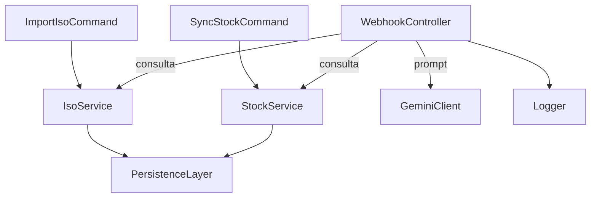
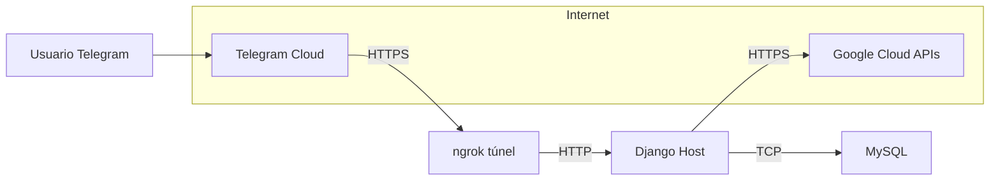

**Nombre del documento**

`4-Arquitectura-BotAsistenciaInternaTelegram.md`

---

## Contenido requerido

### 1  Introducción

* Propósito del documento: describir la arquitectura lógica y física del sistema.
* Alcance: versión mínima del bot con Django + ngrok + MySQL + APIs externas.

### 2  Vista lógica

#### 2.1 Componentes principales

| Identificador | Componente          | Responsabilidad                                      | Lenguaje              |
| ------------- | ------------------- | ---------------------------------------------------- | --------------------- |
| C1            | `WebhookController` | Recibir `POST` de Telegram, despachar casos de uso   | Python/Django         |
| C2            | `StockService`      | Leer tabla `product_stock`                           | SQLAlchemy/Django ORM |
| C3            | `IsoService`        | Buscar texto en `iso_documents`                      | SQL `LIKE`            |
| C4            | `GeminiClient`      | Enviar prompt, recibir respuesta                     | `google-generativeai` |
| C5            | `SyncStockCommand`  | Obtener hoja Google Sheets y actualizar tabla        | Python                |
| C6            | `ImportIsoCommand`  | Cargar Markdown ISO locales a DB                     | Python                |
| C7            | `PersistenceLayer`  | Acceso MySQL                                         | Django ORM            |
| C8            | `Logger`            | Registrar mensajes y respuestas en `telegram_update` | `logging` standard    |

#### 2.2 Diagrama de componentes (Mermaid)

#### 2.3 Dependencias externas

| Componente | API/Servicio          | Protocolo                 |
| ---------- | --------------------- | ------------------------- |
| C1         | Telegram Bot API      | HTTPS                     |
| C4         | Gemini API            | HTTPS                     |
| C5         | Google Sheets API     | HTTPS                     |
| C3         | Archivos Markdown ISO | Sistema de archivos local |

### 3  Vista física

#### 3.1 Nodos

| Nodo | Descripción              | Procesos                                         |
| ---- | ------------------------ | ------------------------------------------------ |
| N1   | Equipo Host (local o VM) | Django `runserver`, Python scripts, ngrok client |
| N2   | Servidor MySQL           | `mysqld` (puede coexistir en N1)                 |
| N3   | Infraestructura Telegram | Webhook dispatcher                               |
| N4   | Google Cloud             | Sheets API, Gemini API                           |
| N5   | Equipo Usuario           | Aplicación Telegram                              |

#### 3.2 Diagrama de despliegue (Mermaid)

#### 3.3 Mapeo de componentes a nodos

| Componente             | Nodo de ejecución                         |
| ---------------------- | ----------------------------------------- |
| C1, C2, C3, C4, C7, C8 | N1                                        |
| C5, C6                 | N1 (invocados por operador o script loop) |
| MySQL schema           | N2                                        |

### 4  Descripción de interacciones en tiempo de ejecución

1. Usuario envía mensaje.
2. Telegram envía webhook a ngrok.
3. ngrok reenvía a `WebhookController`.
4. `WebhookController` decide caso de uso:

   * Para SKU: consulta `StockService`, construye prompt, invoca `GeminiClient`.
   * Para palabra ISO: consulta `IsoService`, construye prompt, invoca `GeminiClient`.
5. Respuesta enviada a Telegram.
6. `Logger` persiste diálogo.

### 5  Consideraciones de arquitectura

* **Seguridad**: TLS provisto por ngrok, variables de entorno fuera del repositorio.
* **Disponibilidad**: reinicio manual de ngrok necesario tras cortes.
* **Escalabilidad**: limitado a un proceso `runserver`; no se abordan usuarios concurrentes altos.
* **Mantenibilidad**: código organizado en servicios; comandos de sincronización separados.

### 6  Historial de versiones

| Versión | Fecha      | Descripción        |
| ------- | ---------- | ------------------ |
| 1.0     | AAAA-MM-DD | Documento inicial. |

---
